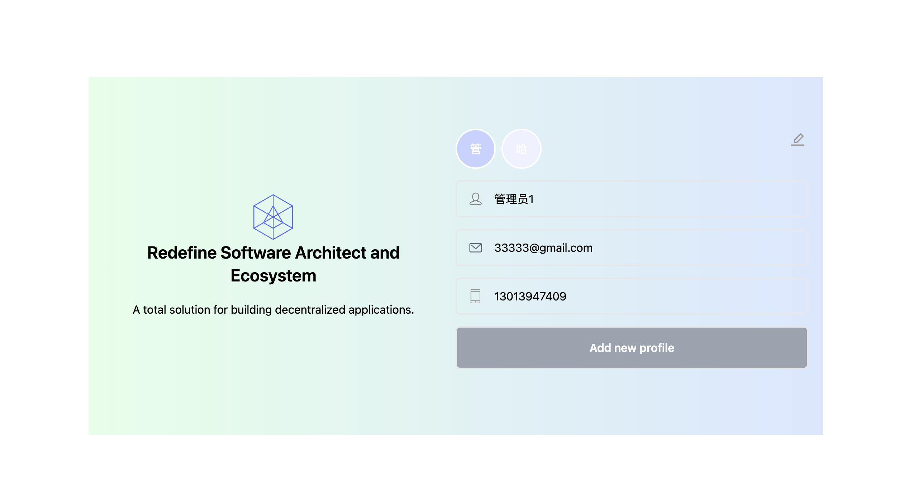
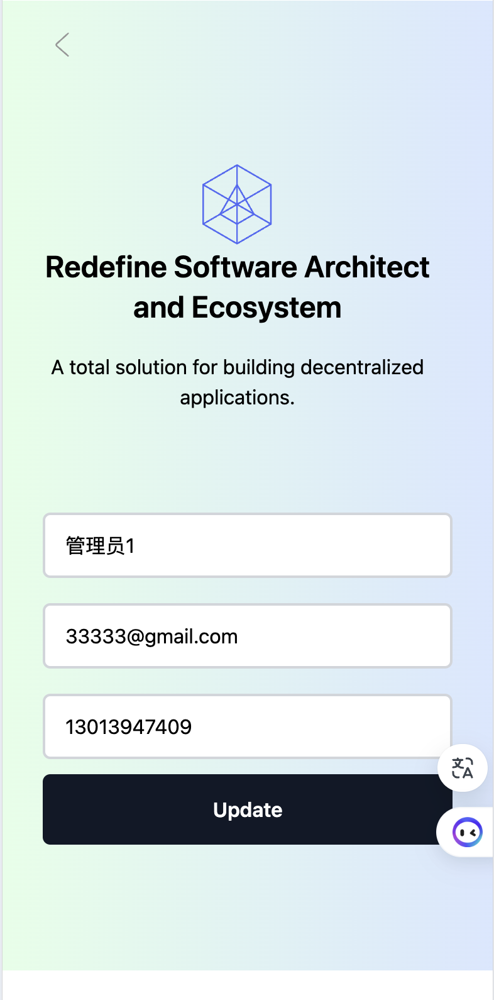

## 电脑端


## 手机端


## 环境:

  电脑: macOS 14.1.2
  Node.js: v19.0.0
  NPM: v8.19.2
  数据库: mysql

## 操作步骤:

```
  1. 在.env 中修改自己环境所运行的mysql 信息（包含：数据库名称，用户名，密码，端口），默认为：
      MYSQL_PORT=3306
      MYSQL_DATABASE=blockclet-project
      MYSQL_USERNAME=root
      MYSQL_PASSWORD=123456
  2. npm install --force
  3. npm run dev 启动

```
